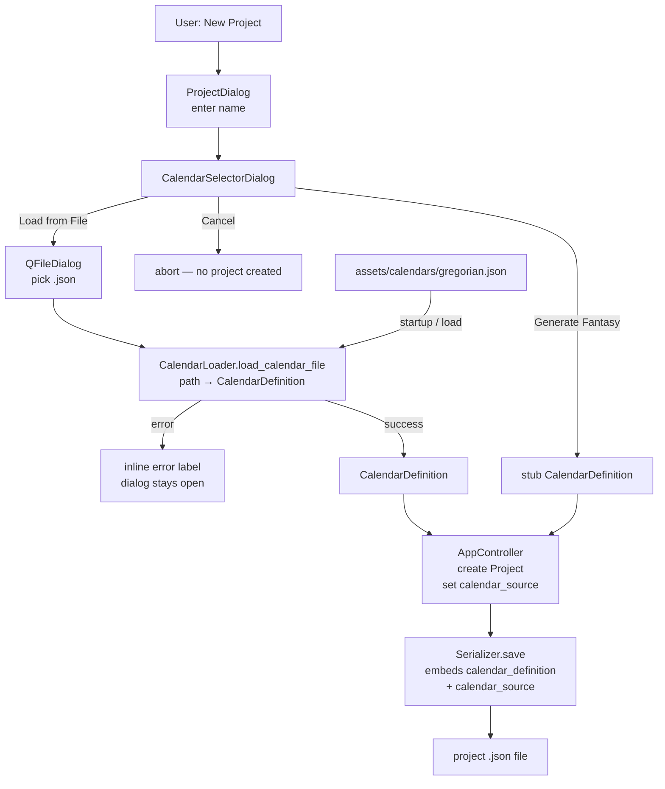

# Design Document: calendar-json-format

## Overview

This feature extracts the `GREGORIAN_DEFAULT` calendar definition from Python source into a standalone JSON file (`assets/calendars/gregorian.json`), establishes a `CalendarLoader` module for reading calendar JSON files, adds a `CalendarSelectorDialog` so users choose a calendar when creating a new project, and records a `calendar_source` string on the `Project` dataclass. The `AppController.on_new_project()` flow is updated to use the dialog instead of hardcoding `GREGORIAN_DEFAULT`.

The existing `Serializer` and `_load_calendar_definition` logic are reused without modification. The project file format remains self-contained and backward-compatible.

---

## Architecture



**Key design decisions:**

- `CalendarLoader` is a thin module (`src/calendar_loader.py`) that validates required keys then delegates to the existing `_load_calendar_definition`. It does not duplicate deserialization logic.
- `CalendarSelectorDialog` owns the file-picking UX and error display; `AppController` only receives the final `CalendarDefinition | None`.
- `calendar_source` is a plain string field on `Project`; the `Serializer` writes and reads it transparently via `dataclasses.asdict` + `data.get("calendar_source", "")`.
- `GREGORIAN_DEFAULT` stays in `models.py` as a fallback for `Serializer.load()` on old project files.

---

## Components and Interfaces

### `src/calendar_loader.py`

```python
CALENDAR_REQUIRED_FIELDS = ("name", "months", "week_length", "weekday_names", "hours_per_day")

def load_calendar_file(path: str) -> CalendarDefinition:
    """
    Read a standalone calendar JSON file and return a CalendarDefinition.

    Raises ProjectLoadError on:
      - file not found
      - malformed JSON
      - missing required top-level fields
      - invalid field values (propagated from _load_calendar_definition)
    """
```

Implementation sketch:
1. Open `path`; on `FileNotFoundError` raise `ProjectLoadError("Calendar file not found: {path}")`.
2. `json.load`; on `JSONDecodeError` raise `ProjectLoadError("Invalid JSON in calendar file: {e}")`.
3. For each field in `CALENDAR_REQUIRED_FIELDS`: if absent raise `ProjectLoadError("Missing required calendar field: '{field}'")`
4. Delegate to `_load_calendar_definition(data)` (imported from `src.serializer`); propagate any `ProjectLoadError`.

---

### `src/views/calendar_selector_dialog.py`

```python
class CalendarSelectorDialog(QDialog):
    def __init__(self, parent=None) -> None: ...

    def get_calendar(self) -> CalendarDefinition | None:
        """
        Return the chosen CalendarDefinition, or None if the dialog was cancelled.
        Call after exec() returns Accepted.
        """
```

Layout (vertical):
- `QLabel`: "Choose a calendar for this project:"
- `QPushButton`: "Load from File"
- `QPushButton`: "Generate Fantasy Calendar"
- `QLabel` (error, hidden by default, red text)
- `QDialogButtonBox`: Cancel only (the two buttons above drive Accept)

Behaviour:
- "Load from File" → opens `QFileDialog.getOpenFileName` filtered to `*.json`. On selection calls `load_calendar_file(path)`. On `ProjectLoadError` shows the error label and stays open. On success stores the result and calls `self.accept()`.
- "Generate Fantasy Calendar" → stores a stub `CalendarDefinition` (see below) and calls `self.accept()`.
- Cancel → calls `self.reject()`; `get_calendar()` returns `None`.

**Stub CalendarDefinition** (minimal valid placeholder):
```python
CalendarDefinition(
    name="Fantasy Calendar",
    months=[MonthDefinition("Month 1", 30)],
    week_length=7,
    weekday_names=["Day 1", "Day 2", "Day 3", "Day 4", "Day 5", "Day 6", "Day 7"],
    hours_per_day=24,
)
```

---

### `src/controller.py` — `AppController.on_new_project`

Replaces the current hardcoded `GREGORIAN_DEFAULT` assignment:

```python
def on_new_project(self) -> None:
    # Step 1: get project name
    name_dialog = ProjectDialog(self._window)
    if name_dialog.exec() != ProjectDialog.DialogCode.Accepted:
        return

    # Step 2: choose calendar
    cal_dialog = CalendarSelectorDialog(self._window)
    if cal_dialog.exec() != CalendarSelectorDialog.DialogCode.Accepted:
        return

    calendar = cal_dialog.get_calendar()
    if calendar is None:
        return

    # Step 3: create project
    self._project = Project(
        name=name_dialog.get_name(),
        calendar_definition=calendar,
        calendar_source=calendar.name,
    )
    self._window.calendar_tab.load_from_project(self._project)
    self._window.set_title(self._project.name)
```

---

## Data Models

### `Project` dataclass (`src/models.py`)

Add one field:

```python
@dataclass
class Project:
    name: str
    version: str = "1.0"
    calendar_definition: CalendarDefinition = field(default_factory=lambda: GREGORIAN_DEFAULT)
    tracked_date: FantasyDateTime | None = None
    calendar_days: list[CalendarDay] = field(default_factory=list)
    calendar_source: str = ""          # NEW — name of the active CalendarDefinition
```

### Serializer changes (`src/serializer.py`)

**Save** — no code change needed. `dataclasses.asdict(project)` will automatically include `calendar_source` in the output dict.

**Load** — add one line when constructing the `Project`:

```python
return Project(
    name=data["name"],
    version=data["version"],
    calendar_definition=cal,
    tracked_date=tracked_date,
    calendar_source=data.get("calendar_source", ""),   # NEW
)
```

### Project JSON schema (additions)

```json
{
  "name": "My Campaign",
  "version": "1.0",
  "calendar_source": "Gregorian",
  "calendar_definition": { ... },
  "tracked_date": null,
  "calendar_days": []
}
```

`calendar_source` is optional on load (defaults to `""`). Existing project files without it load without error.

---

## `assets/calendars/gregorian.json` — File Content

This file mirrors the `GREGORIAN_DEFAULT` constant serialized to the same schema that `Serializer.save()` produces for the `calendar_definition` block.

```json
{
    "name": "Gregorian",
    "months": [
        {"name": "January",   "day_count": 31, "leap_every_n_years": null},
        {"name": "February",  "day_count": 28, "leap_every_n_years": 4},
        {"name": "March",     "day_count": 31, "leap_every_n_years": null},
        {"name": "April",     "day_count": 30, "leap_every_n_years": null},
        {"name": "May",       "day_count": 31, "leap_every_n_years": null},
        {"name": "June",      "day_count": 30, "leap_every_n_years": null},
        {"name": "July",      "day_count": 31, "leap_every_n_years": null},
        {"name": "August",    "day_count": 31, "leap_every_n_years": null},
        {"name": "September", "day_count": 30, "leap_every_n_years": null},
        {"name": "October",   "day_count": 31, "leap_every_n_years": null},
        {"name": "November",  "day_count": 30, "leap_every_n_years": null},
        {"name": "December",  "day_count": 31, "leap_every_n_years": null}
    ],
    "week_length": 7,
    "weekday_names": ["Sunday", "Monday", "Tuesday", "Wednesday", "Thursday", "Friday", "Saturday"],
    "hours_per_day": 24,
    "week_start_offset": 6,
    "lunar_cycles": [],
    "intercalary_periods": [],
    "eras": [
        {"name": "BC", "starting_year": 1, "direction": "descending"},
        {"name": "AD", "starting_year": 1, "direction": "ascending"}
    ]
}
```

---

## Correctness Properties

*A property is a characteristic or behavior that should hold true across all valid executions of a system — essentially, a formal statement about what the system should do. Properties serve as the bridge between human-readable specifications and machine-verifiable correctness guarantees.*

### Property 1: CalendarDefinition dict round-trip

*For any* valid `CalendarDefinition`, serializing it to a dict (via `dataclasses.asdict`), deserializing via `_load_calendar_definition`, serializing again, and deserializing again SHALL produce a `CalendarDefinition` equal to the original.

**Validates: Requirements 1.4**

---

### Property 2: Valid calendar JSON always loads without error

*For any* dict that satisfies the `CalendarDefinition` schema (all required fields present, all values in valid ranges), writing it to a temp file and calling `load_calendar_file` SHALL return a `CalendarDefinition` without raising.

**Validates: Requirements 2.2**

---

### Property 3: Missing required field always raises ProjectLoadError

*For any* valid calendar dict and any non-empty subset of the required fields (`name`, `months`, `week_length`, `weekday_names`, `hours_per_day`), removing those fields and calling `load_calendar_file` SHALL raise a `ProjectLoadError` whose message identifies at least one of the missing fields.

**Validates: Requirements 2.5, 2.6**

---

### Property 4: Serializer embeds full calendar_definition on save

*For any* `Project` with any `CalendarDefinition`, saving via `Serializer.save` and reading the raw JSON SHALL produce a file that contains a `calendar_definition` block with all required calendar fields present.

**Validates: Requirements 4.1**

---

### Property 5: Project serialization round-trip preserves CalendarDefinition

*For any* `Project` with any `CalendarDefinition`, saving via `Serializer.save` then loading via `Serializer.load` SHALL produce a `Project` whose `calendar_definition` is equal to the original.

**Validates: Requirements 4.2**

---

### Property 6: calendar_source round-trip

*For any* `Project` (with or without a `tracked_date`), saving via `Serializer.save` then loading via `Serializer.load` SHALL produce a `Project` whose `calendar_source` equals the `CalendarDefinition.name` that was set at save time.

**Validates: Requirements 6.1, 6.2, 6.3, 6.5**

---

## Error Handling

| Scenario | Component | Exception / Behaviour |
|---|---|---|
| Calendar file not found | `CalendarLoader.load_calendar_file` | `ProjectLoadError("Calendar file not found: {path}")` |
| Calendar file contains malformed JSON | `CalendarLoader.load_calendar_file` | `ProjectLoadError("Invalid JSON in calendar file: {e}")` |
| Calendar JSON missing required field | `CalendarLoader.load_calendar_file` | `ProjectLoadError("Missing required calendar field: '{field}'")` |
| Calendar JSON has invalid field value (e.g. day_count out of range) | `_load_calendar_definition` (propagated) | `ProjectLoadError("Invalid calendar definition: {e}")` |
| User picks a bad file in CalendarSelectorDialog | `CalendarSelectorDialog` | Inline error label shown; dialog stays open |
| User cancels CalendarSelectorDialog | `AppController.on_new_project` | Returns early; application state unchanged |
| Project file missing `calendar_source` | `Serializer.load` | `calendar_source` defaults to `""`; no error |
| Project file missing `calendar_definition` | `Serializer.load` | Falls back to `GREGORIAN_DEFAULT`; no error |
| OS error writing project file | `Serializer.save` | `OSError` propagated; temp file cleaned up |

---

## Testing Strategy

Per the workspace testing policy, unit tests are not required. The correctness properties above serve as the formal specification for any future property-based tests should the policy change.

If property-based tests are added, the recommended library is **Hypothesis** (Python). Each property maps to a single `@given`-decorated test with a minimum of 100 examples. Tag format: `# Feature: calendar-json-format, Property {N}: {property_text}`.

Integration smoke checks (manual or CI):
- Load `assets/calendars/gregorian.json` via `load_calendar_file` and assert the result equals `GREGORIAN_DEFAULT`.
- Create a new project via the UI, choose "Load from File" with `gregorian.json`, save, reload, and verify the calendar is intact.
