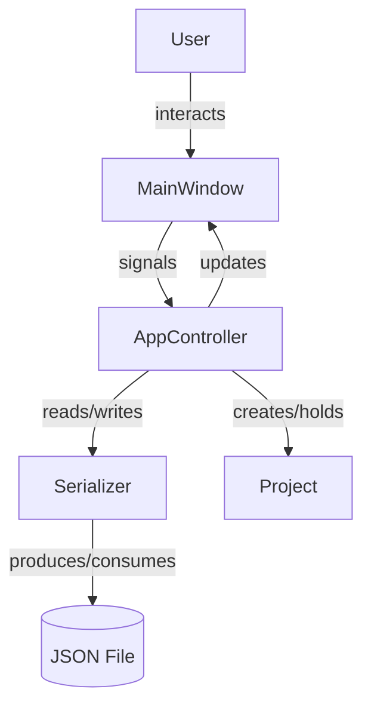

# Design Document: TTRPG DM Tool

## Overview

A desktop campaign management application for Dungeon Masters running sword-and-sorcery fantasy TTRPGs virtually. Built with Python and PyQt6, the application is system-agnostic and organizes campaign data into "projects" — one per campaign — persisted as JSON files on disk.

This initial scope delivers the core application shell: a resizable main window with a tabbed interface and a File menu supporting project creation, saving, and loading. The design prioritizes simplicity, extensibility (new tabs/features can be added later), and data portability via human-readable JSON.

---

## Architecture

The application follows a lightweight MVC-style separation:

- **Model** — `Project` dataclass holding campaign data; `Serializer` handles JSON I/O.
- **View** — PyQt6 widgets: `MainWindow`, `TabArea`, `ProjectDialog`.
- **Controller** — `AppController` wires together user actions (menu signals) with model operations and view updates.



The entry point (`main.py`) constructs the `QApplication`, instantiates `MainWindow` and `AppController`, then starts the event loop.

---

## Components and Interfaces

### `Project` (Model)

A plain dataclass representing a single campaign.

```python
@dataclass
class Project:
    name: str
    version: str = "1.0"
```

Additional fields (NPCs, locations, sessions, etc.) will be added in future iterations. The `version` field enables forward-compatible schema migrations.

### `Serializer`

Responsible for all JSON I/O. Stateless — operates purely on `Project` instances and file paths.

```python
class Serializer:
    def save(self, project: Project, path: str) -> None: ...
    def load(self, path: str) -> Project: ...
```

- `save` writes pretty-printed JSON (4-space indent) to `path`.
- `load` reads and validates the JSON, raising `ProjectLoadError` for missing required fields or malformed content.

### `MainWindow` (View)

Top-level `QMainWindow` subclass.

- Sets a default size (e.g. 1024×768) and a minimum size (e.g. 640×480).
- Contains a `QMenuBar` with a `File` menu.
- Contains a `QTabWidget` as the central widget.
- Exposes `set_title(project_name: str)` to update the window title.
- Emits signals (or calls controller slots) for: `new_project`, `save_project`, `load_project`.

### `ProjectDialog` (View)

A `QDialog` subclass for entering a new project name.

- Contains a `QLineEdit` for the name and OK/Cancel buttons.
- Validates on OK: if the name is empty or whitespace-only, shows an inline `QLabel` error and keeps the dialog open.
- Returns the entered name on acceptance.

### `AppController` (Controller)

Owns the active `Project` (or `None`) and coordinates between view and model.

```python
class AppController:
    def __init__(self, window: MainWindow, serializer: Serializer): ...
    def on_new_project(self) -> None: ...
    def on_save_project(self) -> None: ...
    def on_load_project(self) -> None: ...
```

---

## Data Models

### Project JSON Schema

```json
{
  "name": "The Sunken Citadel",
  "version": "1.0"
}
```

| Field     | Type   | Required | Description                        |
|-----------|--------|----------|------------------------------------|
| `name`    | string | yes      | Human-readable campaign name       |
| `version` | string | yes      | Schema version for future migration|

Required fields are validated on deserialization. Missing fields raise `ProjectLoadError` with a message identifying the missing field.

### Error Types

```python
class ProjectLoadError(Exception):
    """Raised when a project file cannot be parsed or is missing required fields."""
```

---


## Correctness Properties

*A property is a characteristic or behavior that should hold true across all valid executions of a system — essentially, a formal statement about what the system should do. Properties serve as the bridge between human-readable specifications and machine-verifiable correctness guarantees.*

### Property 1: Tab area contained within window bounds

*For any* window size at or above the minimum size, the `Tab_Area` widget's geometry shall be fully contained within the `Main_Window`'s geometry (no clipping, no overflow).

**Validates: Requirements 2.1, 2.2**

---

### Property 2: Tab selection foregrounds correct view

*For any* valid tab index in the `Tab_Area`, setting that index as the current tab shall make the corresponding widget the visible (foreground) widget.

**Validates: Requirements 3.2**

---

### Property 3: New project name is preserved

*For any* non-empty, non-whitespace string used as a project name in `ProjectDialog`, confirming the dialog shall result in an active `Project` whose `name` field equals that string exactly.

**Validates: Requirements 4.2**

---

### Property 4: Whitespace project names are rejected

*For any* string composed entirely of whitespace characters (including the empty string), submitting it in `ProjectDialog` shall be rejected — the dialog shall remain open and the active project state shall be unchanged.

**Validates: Requirements 4.3**

---

### Property 5: Title bar reflects active project name

*For any* project that becomes active (whether via creation or loading), the `Main_Window` title bar shall contain that project's name.

**Validates: Requirements 4.5, 6.3**

---

### Property 6: Serialization round-trip

*For any* valid `Project` object, serializing it to JSON and then deserializing the result shall produce a `Project` that is equivalent to the original (all fields equal).

**Validates: Requirements 7.3, 7.2, 5.1, 6.2**

---

### Property 7: Serialized output is valid, pretty-printed JSON containing required fields

*For any* valid `Project`, the output of `Serializer.save` shall be parseable by a standard JSON parser, shall use indented formatting (at least one newline in the output), and shall contain both a `name` field and a `version` field matching the project's values.

**Validates: Requirements 5.3, 7.1**

---

### Property 8: Missing required field raises descriptive error

*For any* required field (`name`, `version`), deserializing a JSON object with that field removed shall raise a `ProjectLoadError` whose message identifies the missing field by name.

**Validates: Requirements 7.4**

---

## Error Handling

| Scenario | Handler | User Feedback |
|---|---|---|
| Save with no active project | `AppController.on_save_project` | `QMessageBox.information` — "No project to save." |
| File write error during save | `Serializer.save` raises `OSError` | `QMessageBox.critical` — includes OS error message; original file untouched |
| Load: file not valid project JSON | `Serializer.load` raises `ProjectLoadError` | `QMessageBox.critical` — includes field/parse error detail |
| Load: file read error | `Serializer.load` raises `OSError` | `QMessageBox.critical` — includes OS error message |
| New project: empty/whitespace name | `ProjectDialog` inline validation | Inline `QLabel` error; dialog stays open |

All error dialogs are modal and block the main window until dismissed. No application state is mutated when an error occurs.

---

## Testing Strategy

### Dual Testing Approach

Both unit tests and property-based tests are required. They are complementary:

- **Unit tests** cover specific examples, startup state, and error conditions.
- **Property tests** verify universal invariants across randomly generated inputs.

### Unit Tests (pytest)

Focus areas:
- Application launch: window has menu bar, tab widget, "Campaign Overview" tab (Requirements 1.1, 3.1, 3.3).
- Minimum window size is enforced (Requirement 2.3).
- Cancel on `ProjectDialog` leaves state unchanged (Requirement 4.4).
- Save with no active project shows info message (Requirement 5.2).
- Write error shows error dialog and leaves file unchanged (Requirement 5.4).
- Load with invalid JSON shows error dialog and leaves state unchanged (Requirements 6.4, 6.5).
- File picker is filtered to JSON files (Requirement 6.1).

### Property-Based Tests (Hypothesis)

Library: **Hypothesis** (`pip install hypothesis`)

Each property test runs a minimum of **100 iterations** (configured via `@settings(max_examples=100)`).

Each test is tagged with a comment in the format:
`# Feature: ttrpg-dm-tool, Property <N>: <property_text>`

| Property | Test Description |
|---|---|
| P1: Tab area contained in window | Generate random window sizes ≥ minimum; resize and assert tab widget rect ⊆ window rect |
| P2: Tab selection foregrounds view | Generate random tab counts and indices; set current index and assert currentWidget matches |
| P3: New project name preserved | Generate arbitrary non-empty strings; simulate dialog acceptance and assert `project.name == input` |
| P4: Whitespace names rejected | Generate whitespace-only strings; assert dialog rejects and state is unchanged |
| P5: Title bar reflects project name | Generate arbitrary project names; create/load project and assert window title contains name |
| P6: Serialization round-trip | Generate arbitrary `Project` instances; serialize to temp file, deserialize, assert equality |
| P7: Serialized JSON is valid and contains required fields | Generate arbitrary `Project` instances; serialize and assert JSON validity, indentation, and field presence |
| P8: Missing field raises descriptive error | For each required field, generate valid projects, remove field from JSON, assert `ProjectLoadError` message contains field name |

Each correctness property MUST be implemented by a single property-based test.
